<div align="center">

# 🛰️ NetDash

**A home-network monitor that tells you *what* broke, *where* it broke (your home or your ISP), and *what to do* — before you notice.**


[](docs/HIGHLIGHTS.md)


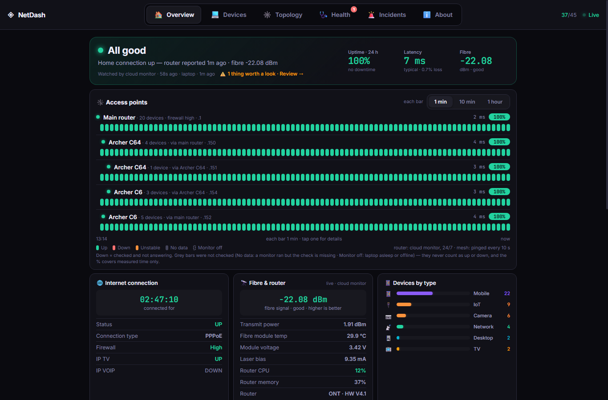

</div>

---

## The problem

A network with fibre internet, an ISP router and a mesh of Wi-Fi access points — in a home, a school or an office —
fails in confusing ways:
*"Wi-Fi connected, no internet"*, one room's access point dropping, the router needing a restart, or the ISP
itself being down. Consumer apps show **that** something is wrong — not **which layer** failed or **who** should fix it.

NetDash watches every layer continuously, from both **inside** the home and **outside** it, and turns raw
probes into a plain-language verdict with evidence, confidence and the exact next step.

## ✨ What it does

| | Feature | Details |
|---|---|---|
| 🩺 | **Diagnosis, not just alerts** | 15+ failure classes, exercised by 18 simulated scenarios (router down, ISP outage, DNS, DHCP, mesh node / backhaul, Wi-Fi association, single device…) with evidence, confidence, alternatives and recommended actions. |
| 🛰️ | **24/7 outside-in watch** | A cloud "sentinel" hears the router's own syslog heartbeat. Silence + an outside ping of the ISP gateway tells *home offline* from *ISP outage* — even with the laptop off. |
| 📶 | **Uptime-Kuma-style heartbeat bars** | Per access point, 1 min / 10 min / 1 h buckets on local-time edges. Five explicit states — **Up · Down · Unstable · No data · Monitor off** — so missing data is never shown as up or down. |
| 🕸️ | **Live mesh topology** | Interactive tree of router → access points → devices, with signal, band and latency per node. |
| 🚨 | **Incident timeline** | Start/end/duration, affected nodes and devices, black-box samples, recurrence patterns, "what fixed it" — one parent incident per outage, never an alert storm. |
| 🤖 | **Telegram bot** | Alerts (open / escalate / resolve, mute with catch-up, false-alarm corrections) and interactive screens: status, mesh, devices, who's home, today's report. |
| 👪 | **People & presence** | Assign devices to people; "who's home" from the devices they carry, with nap smoothing. |
| 🔐 | **Two audiences, one app** | Owner and admins see everything; public visitors get a redacted view (no IPs, MACs, SSIDs, firmware, presence) served by a separate API — and nothing tells them it's reduced. |
| 🧭 | **Any network, set up in the app** | v1.0 runs on any installation: a generic router adapter (any router) plus vendor adapters, device identification from the IEEE registry and what devices announce (no hard-coded lists), and a **Settings** page for the network's name, ISP, router, time zone, access-point names, report times, admins and visitors. A new install shows "waiting for the first report" screens, not endless loading. |
| 🧱 | **Honest when things break** | If the database can't be reached, every page says *"Can't load the latest data right now"* and the header shows *Reconnecting…* — never a stale "all clear". |

## 📸 Screens

<sub>Captured from the production app. Access points are shown by model and personal device names are replaced; the
heartbeat-bar history uses sample data so the shots aren't dominated by the monitoring laptop's sleep gaps.</sub>

<table>
<tr>
<td width="50%">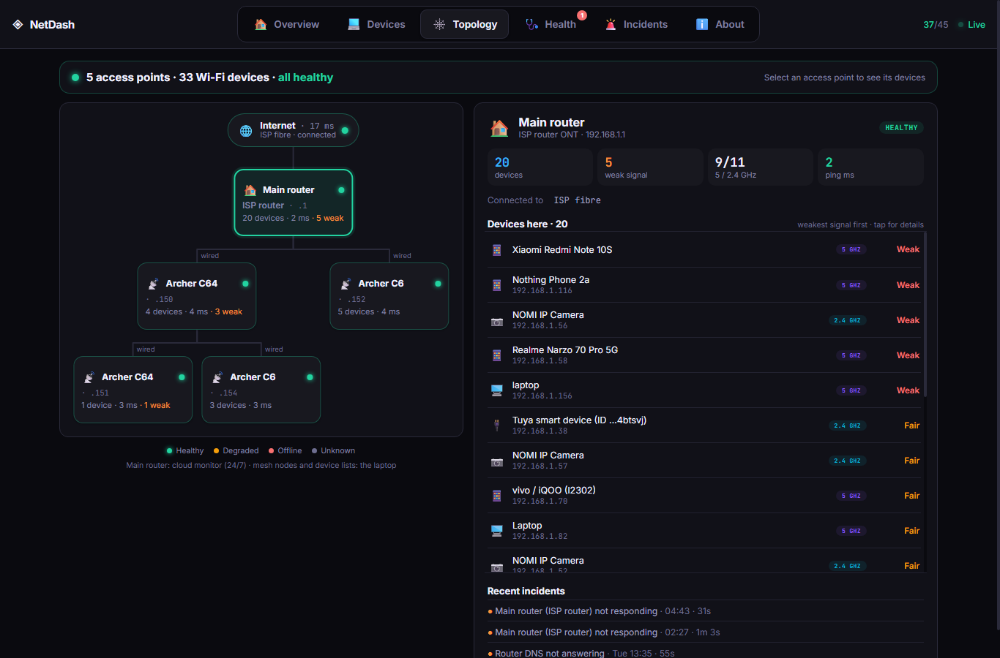<br><sub><b>Topology</b> — mesh tree, per-access-point devices and signal</sub></td>
<td width="50%">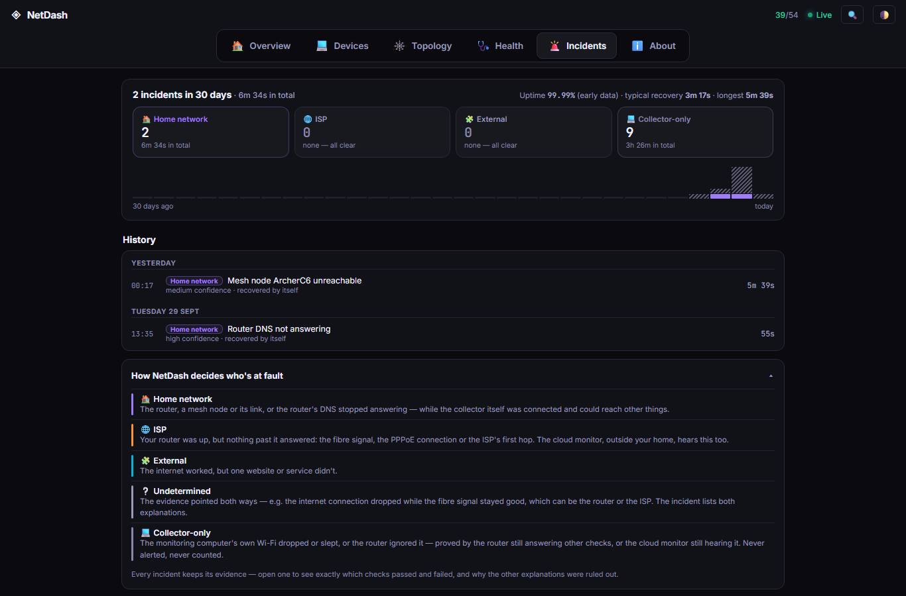<br><sub><b>Incidents</b> — who was at fault (home · ISP · external · monitor only), uptime, recovery times, history</sub></td>
</tr>
<tr>
<td>
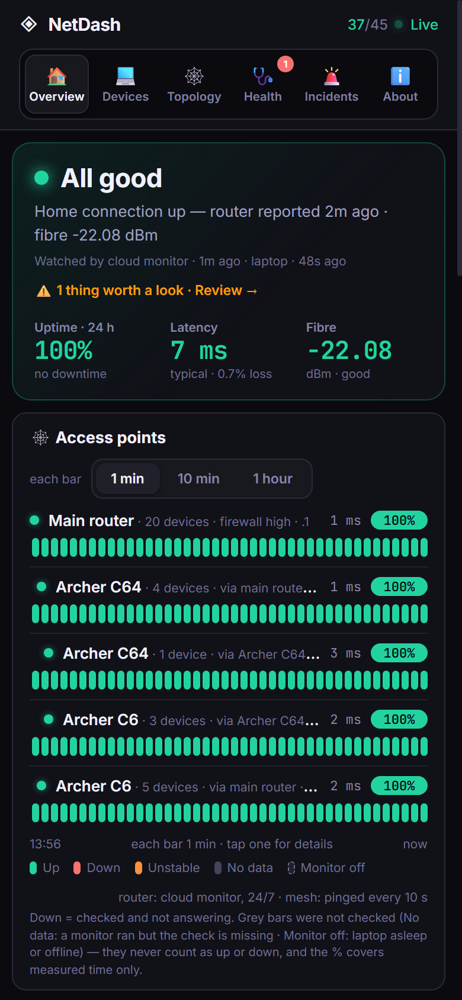<br><sub><b>Phone</b> — installable PWA</sub></td>
<td>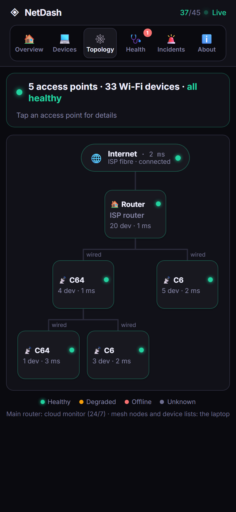<br><sub>Also laid out for tablets and Android TV</sub>
</td>
</tr>
</table>

### 🤖 Telegram bot

<sub>Real bot output, rendered as a chat. Access points are shown as generic rooms and device names are replaced.</sub>

<table>
<tr>
<td width="25%">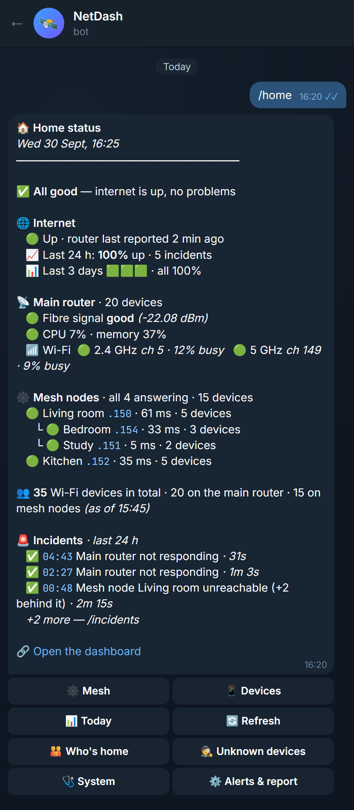<br><sub><b>Home</b> — internet, router, fibre, Wi-Fi, mesh and the last 24 h at a glance</sub></td>
<td width="25%">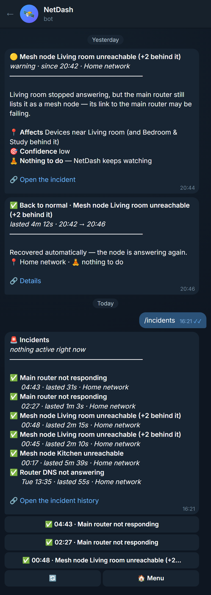<br><sub><b>Alerts</b> — what happened, what's affected, what to do, then "back to normal"</sub></td>
<td width="25%">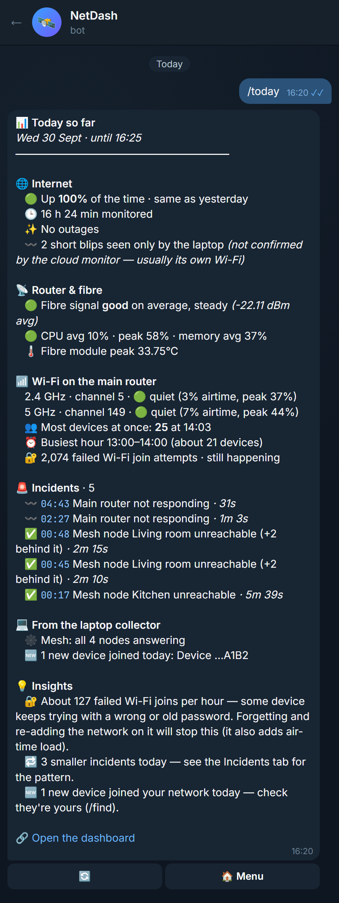<br><sub><b>Today</b> — outages vs. laptop-only blips, router health, Wi-Fi load, insights</sub></td>
<td width="25%">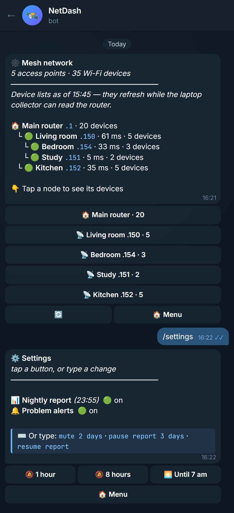<br><sub><b>Mesh & settings</b> — tap a node for its devices; one-tap mute</sub></td>
</tr>
</table>

## 🏗️ Architecture

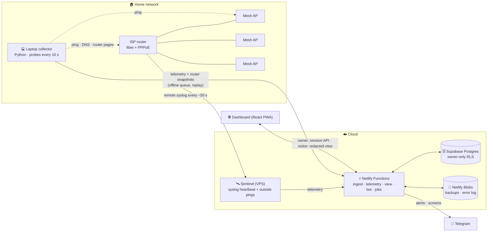

### How an outage gets a verdict

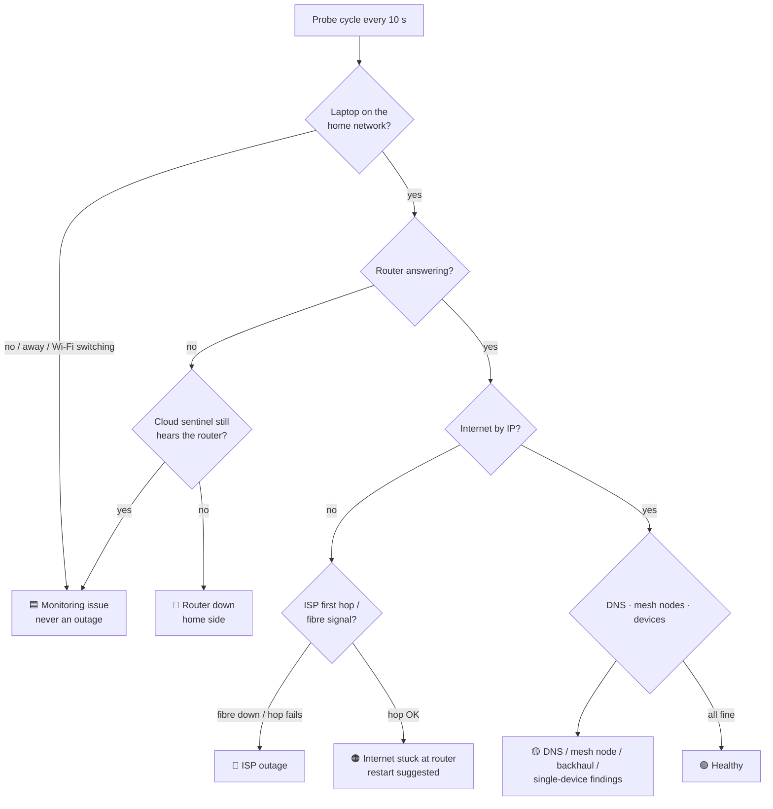

## 🧰 Tech stack

| Layer | Tech |
|---|---|
| Frontend | React 18 (single-file JSX → esbuild bundle), installable PWA with service worker, strict CSP |
| API | Netlify Functions (Node 22, ESM), scheduled jobs (watchdog 10 min, cleanup + backup nightly, daily report) |
| Data | Supabase Postgres with owner-only Row Level Security, realtime "something changed" nudges |
| Collector | Python — ICMP/DNS/TCP/HTTPS probes, rate-limited router scraping, LAN fingerprinting, on-disk offline queue |
| Sentinel | Python systemd service on a VPS — UDP syslog receiver, unprivileged ICMP, crash-safe state |
| Alerts | Telegram Bot API — webhook with secret verification, role-based screens, HMAC-signed background jobs |

## 🔬 Engineering highlights

- **Honest data** — every heartbeat bucket has an explicit state; uptime is computed over *measured* time only and says how much was measured. Late uploads keep their original timestamps and are marked as delayed, not missing.
- **No false alarms from the monitor itself** — laptop sleep, Wi-Fi switching, phone-hotspot bridging, stray virtual adapters and broken router reads are all classified as *monitoring* issues; laptop "router down" verdicts are cross-checked against the cloud sentinel and relabelled (with a "false alarm" follow-up) when it heard the router all along.
- **Resilience** — the collector buffers telemetry on disk when offline and replays it in order; the server upserts idempotently, ignores out-of-date replays and skips malformed data instead of blocking the queue.
- **Privacy by construction** — visitors are served through a separate endpoint that redacts IPs, MACs (HMAC stand-ins), SSIDs and firmware, including inside free text; an automated audit checks every page for leaks.
- **Security** — Supabase RLS denies anonymous access to every table; every API endpoint verifies the owner's session or the collector key; strict CSP, HSTS, no framing; public endpoints are rate-limited.
- **Operability** — health endpoint for uptime monitors, job check-ins, web-app crash reports from any visitor, nightly backups of everything entered by hand, version stamp in the UI.
- **Steady, fast pages** — nothing jumps while data loads (layout shift 0.04, well under the 0.1 "good" mark): sections hold the space they took last time until all their inputs are in. Settings is fetched in the background, so it opens at once.
- **Guarded build** — the test gate fails on stray control characters in source (a shell-mangled `\b` once silently broke a regex), and CI runs every suite on Linux, macOS and Windows plus the database rules on Postgres.

## ✅ Testing

```bash
npm test             # 225 Python tests (diagnosis, incidents, collector, sentinel) + 8 JS suites
                     # (identification, names, presence, reconcile, redaction, bot, web)
bash tests/db/run.sh # schema + access rules on a real Postgres (Docker)
npm run deploy       # runs the full test gate, builds, deploys — refuses if anything fails
```

Plus headless-Chrome checks against the live site: smoke tests at phone / tablet / desktop / TV widths for owner and
visitor, a click-every-control error sweep, a privacy audit (admin vs visitor, on screen and in every response),
light/dark themes with WCAG contrast of every text, "go there" navigation, People and Dismiss/Restore flows (which
put the real data back exactly), and performance (load, tab switches, layout shift).
Failure scenarios (router down, ISP outage, mesh node loss, DHCP failure, …) are replayed through the real
diagnosis engine with `simulate_run.py`.

## 🔒 About this repository

NetDash runs in production 24/7. Since v1.0 it can be installed on any network (homes, schools, offices); the full
source stays private. This showcase has the README, architecture, screenshots with personal details replaced, and
**[real code excerpts](docs/HIGHLIGHTS.md)** from the hard parts. A walkthrough of the live system and the full code
are available to prospective clients on request.

<details>
<summary><b>📂 How the private codebase is organised</b></summary>

```
public/index.html          the web app (React 18 JSX) → esbuild bundle
netlify/functions/         API endpoints, scheduled jobs, Telegram bot, shared modules
                           (_site: per-installation settings · _auth: owner + admins · _redact: visitor view)
monitor.py diagnose.py     collector: probe loop, failure classifier
incidents.py probes.py     incident lifecycle + black box, network probes
routers/                   router adapters: generic (any router) + vendor-specific, behind one interface
sentinel/                  VPS service (syslog heartbeat, outside-in ISP checks)
supabase/                  schema.sql for fresh installs + migrations for upgrades
install/ Dockerfile        collector as a Windows task, a Linux / macOS service or a container
tests/                     Python unittest + node suites + Postgres access-rule tests
tools/                     headless-browser checks, bot preview
docs/                      install, configuration, routers, Telegram, sentinel, operations, upgrading
```
</details>

---

<div align="center">

Designed and built by **[Gazzy](https://github.com/gazzy-source)** — full-stack web, cloud functions, Python services and IoT/network tooling.<br>
<sub>Need a dashboard, monitoring system, automation or bot like this built? Open an issue here or reach out through my GitHub profile.</sub>

</div>
